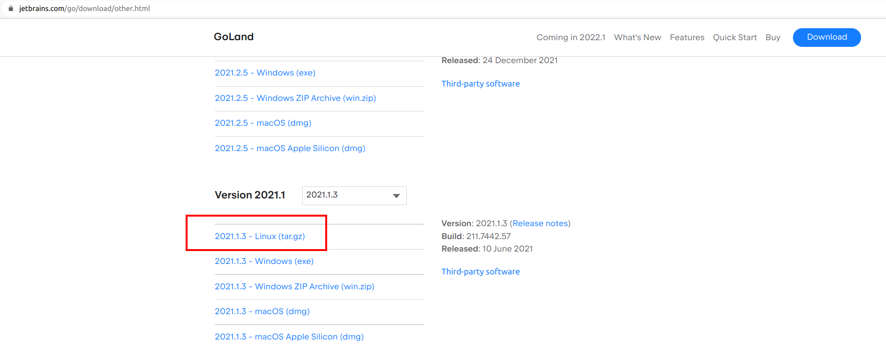
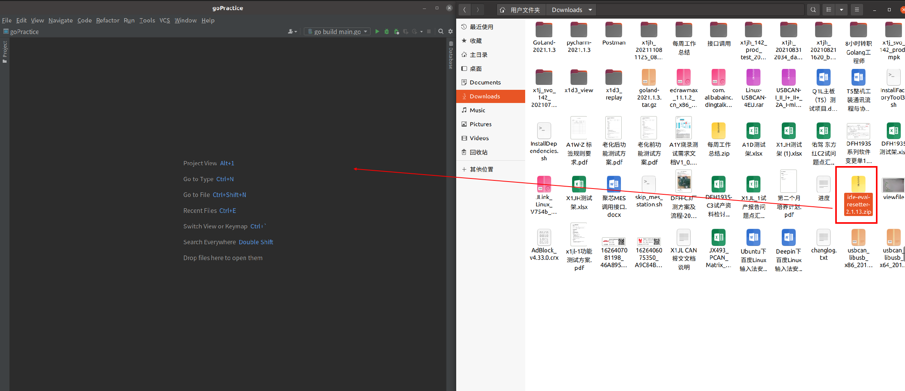
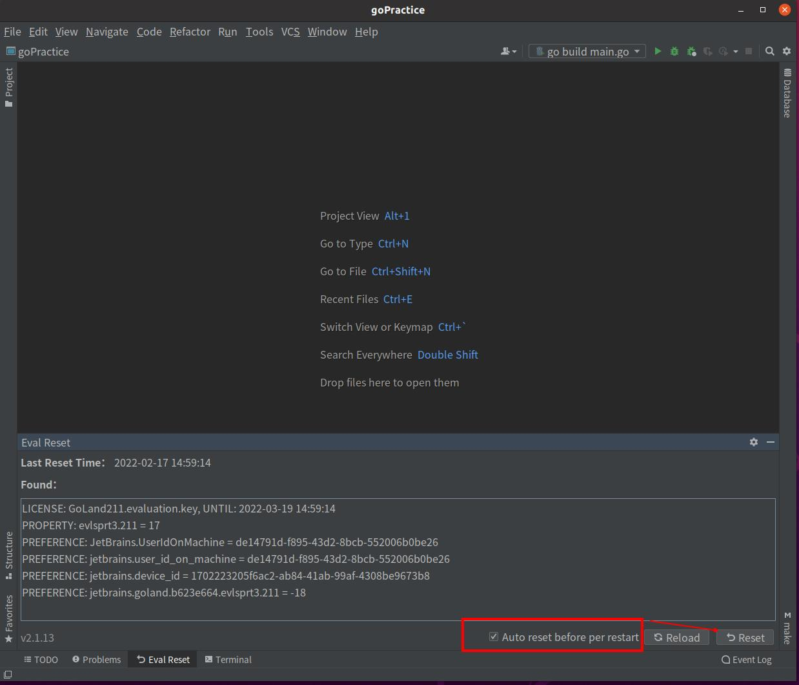
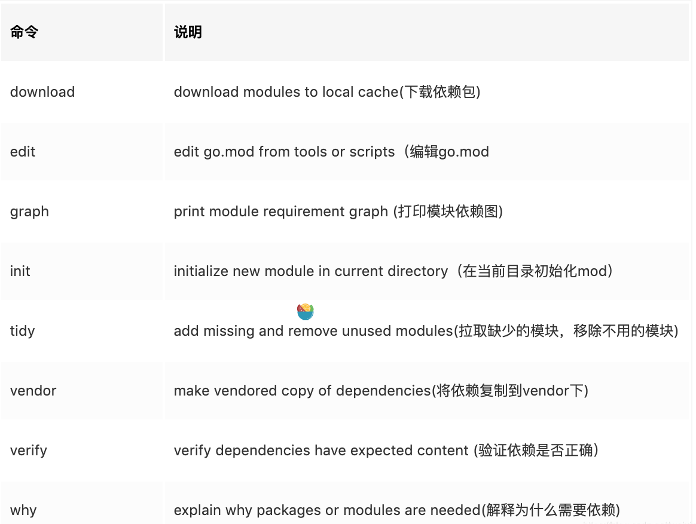
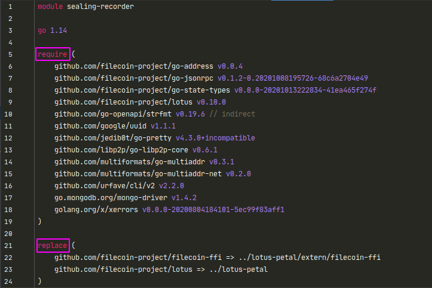
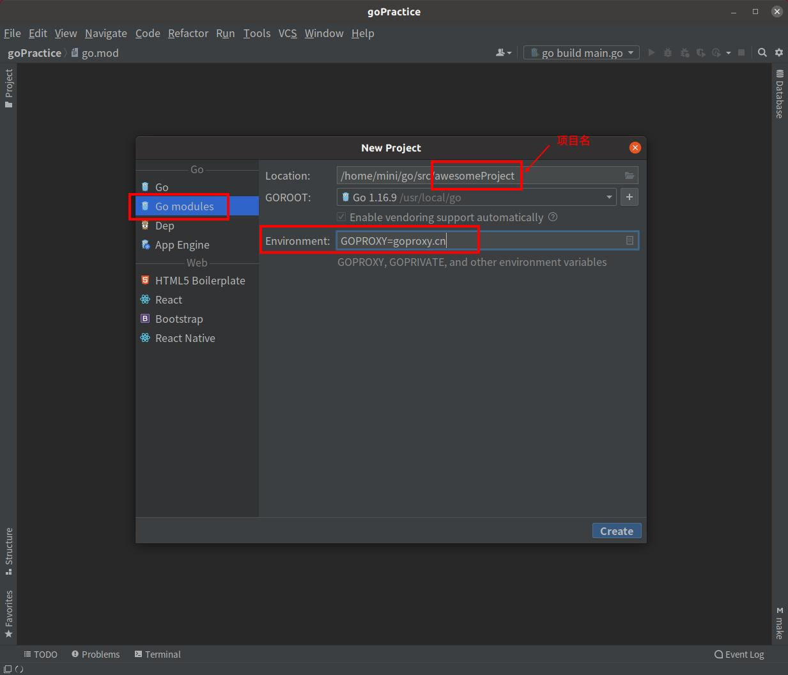

# Go环境安装和开发指南

## 1. 安装Go

以下安装方式以Lunix系统为例

### 1.1 下载Go安装包

打开命令行终端，输入如下命令：

```bash
wget https://studygolang.com/dl/golang/go1.15.5.linux-amd64.tar.gz
```

### 1.2 解压并移动

```bash
tar -xvf go1.15.5.linux-amd64.tar.gz && mv go/ /usr/local
```

### 1.3 添加环境变量

```bash
vim ~/.bashrc

// 加入以下内容
export GOROOT="/usr/local/go"
export GOPATH="$HOME/go"
export GOBIN="$GOROOT/bin"
export GOPROXY="https://goproxy.cn"
export PATH="$PATH:$GOROOT/bin"
```

### 1.4 刷新配置

```bash
source ~/.bashrc
```

### 1.5 查看版本

```bash
go version
```

## 2. 安装Go开发IDE

Go开发工具推荐使用GoLand

### 2.1 下载GoLand

浏览器打开[GoLand 下载地址](https://www.jetbrains.com/go/download/other.html) 下载2021.1版本GoLand，以便破解



### 2.2 安装GoLand

打开命令行终端，输入如下命令：

```bash
tar -zxvf goland-2021.1.3.tar.gz -C ~/
```

### 2.3 下载破解工具

[GoLand 破解工具下载地址](http://gofile.me/4hhCu/RIRgUButD)

### 2.4 使用破解工具破解GoLand

1. 启动GoLand

```bash
cd ~/GoLand-2021.1.3/bin/
./goland.sh
```

2. 30天试用模式进入GoLand
3. 将破解工具包 **（不要解压）** 拖入GoLand软件界面内，破解工具自动安装



1. 配置破解工具，勾选`Auto reset before per restart`，点击`Reset`重启软件

2. 软件重启后，点击软件上方菜单栏`Tools` >>>`Create Desktop Entry...`创建系统菜单内快捷方式
3. 若后续试用过期，可进入软件内，点击软件上方菜单栏`Help`>>>`Eval Reset`强制刷新试用时间
4. 完成破解

## 3. Go mod介绍

Go mod是Golang的包管理工具,使用Go mod可以在GOPATH/src目录之外创建项目,方便管理项目的依赖包

### 3.1 GO111MODULE参数值

GO111MODULE有三个值: off, on和auto.

- `GO111MODULE=off`，go命令行将不会支持module功能，寻找依赖包的方式将会沿用旧版本那种通过vendor目录或者GOPATH模式来查找

- `GO111MODULE=on`，go命令行会使用modules，而一点也不会去GOPATH目录下查找

- `GO111MODULE=auto`，默认值，go命令行将会根据当前目录来决定是否启用module功能。这种情况下可以分为两种情形：

  - 当前目录在GOPATH/src之外且该目录包含go.mod文件
  - 当前文件在包含go.mod文件的目录下面

### 3.2 开启Go mod

```bash
export GO111MODULE=on   // Linux
```

### 3.3 Go mod命令



**go.mod文件命令**

go.mod 提供了`module`, `require`、`replace`和`exclude`四个命令:

- `module`语句指定包的名字（路径）
- `require`语句指定的依赖项模块
- `replace`语句可以替换依赖项模块
- `exclude`语句可以忽略依赖项模块

**案例:**



### 3.4 如何在项目中使用go mod

1. 初始化一个moudle，模块名为项目名

运行完之后，会在当前目录下生成一个go.mod文件，这是一个关键文件，之后的包的管理都是通过这个文件管理

```bash
go mod init 模块名
```

**注意**：子目录里是不需要init的，所有的子目录里的依赖都会组织在根目录的go.mod文件里

2. 下载modules到本地cache

```bash
go mod download
```

3. 删除错误或者不使用的modules

```bash
go mod tidy
```

4. 验证依赖是否正确

```bash
go mod verify
```

## 4. Go项目创建

### 4.1 使用go mod创建

打开命令行终端，输入如下命令：

```bash
mkdir project-name
cd project-name
go mod init project-name
```

### 4.2 使用GoLand IDE创建

打开GoLand软件，点击软件上方菜单栏`File` >>>`New`>>>`Project...`，在弹出的窗口中输入以下内容：



点击`Create`完成创建

## 5. Go项目目录结构

### 5.1 Go项目目录结构规范

目录结构推荐参考 [Standard Go Project Layout](https://github.com/golang-standards/project-layout/blob/master/README_zh.md)，此规范非官方标准，但在github上star很多，被广泛认可。

### 5.2 个人建议目录结构

个人推荐纯后端目录结构如下（仅供参考，具体目录根据需求和功能而定）：

```shell
.
├── api				// 接口
├── configs			// 配置文件
├── docs			// 说明文档
├── logs			// 日志文件夹
├── middleware		// 中间件
├── model			// 数据表模型
├── routes			// 路由文件夹
├── test			// 测试用例文件夹
├── utils			// 公共函数文件夹
├── go.mod			// 项目依赖包
├── main.go			// 项目入口文件
└── README.md		// 项目说明文件
```
